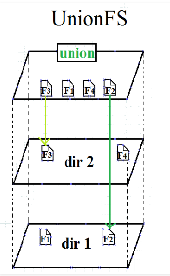

# Note of Docker 
## The Application of Docker
- Automating the packaging and deployment of applications
- Automated testing and continuous integration and deployment
- Deploying and adjusting databases or other backend applications in a service-oriented environment
- Compiling from scratch or extending existing OpenShift or Cloud 
- Foundry platforms to build your own `PaaS` environment

## The Structure of Docker 
`Docker` includes three basic concepts:
| Name | Description |
|-|-|
| `Image` | Docker images act as **a set of instructions to build a Docker container**. |
| `Container` | A container is a standard unit of software that packages up code and all its dependencies so the application runs quickly and reliably from one computing.    Image can be seen as **static abstract define**, and `Container` is the instance of the image. |
| `Docker Hub repositories` | `Repository` allow you share container images with your team, customers, or the Docker community at large. |
| `Docker Client` | The Docker client talks to the Docker daemon, which does the heavy **lifting(舉)** of building, running, and distributing your Docker containers.  |
| `Docker Host` | `Host` is the base traditional OS server where the OS and processes are running in non-container mode.  |

## Compare with VM
| Feature |	Container	| Virtual Machine |
|-|-|-|
| Startup speed |	Seconds |	Minutes |
| Disk usage |	Typically MB | Typically GB |
| Performance |	Close to native	| Weaker than native |
| System support |	Single machine can support thousands of containers | Typically a few dozen |

## The base of docker
### `namespace`
The basis of container isolation, ensuring that container A cannot see container B.
### `cgroups`
- `cgroups` stands for `Control Groups` and the main `cgroups` subsystems used are `cpu`, `blkio`, `device`, `freezer`, `memory`
- In reality, Docker uses many of Linux's isolation features to make the container look like a lightweight virtual machine running independently. The essence of a container is a restricted process with `Namespaces`, `cgroups`, a logically independent `file system`, and `network`, that has been restricted.
- It is essentially a resource management mechanism that limits, records, and isolates the group of processes used by physical resources provided by Linux.

### `UnionFS`
  
  - It allows files and directories of separate file systems
  - `AUFS`: Advanced UnionFS
  - [wiki](https://en.wikipedia.org/wiki/UnionFS)

## Reference
- https://www.cnblogs.com/crazymakercircle/p/15400946.html
- https://stackoverflow.com/questions/33307538/what-is-the-difference-between-docker-host-and-container